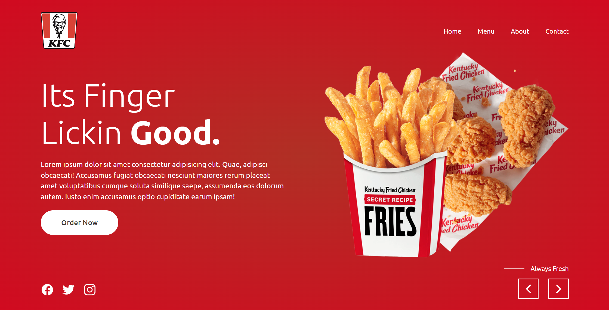

# KFC Landing Page

Welcome to the KFC Landing Page project! This is a simple landing page designed using HTML and CSS to replicate the appearance of KFC's website.

## Table of Contents
- [Demo](#demo)
- [Features](#features)
- [Getting Started](#getting-started)
- [Contributing](#contributing)
- [License](#license)

## Demo

<div align="center">
  
  

  <h2 align="center">KFC</h2>

  This website is fully responsive KFC-Landing-page, <br />Responsive for all devices, built using HTML, CSS, and JavaScript.

  <a href="https://ai-rupak.github.io/KFC-Landing-page.github.io/"><strong>➥ Live Demo</strong></a>

</div>

<br />
### Demo Screeshots



This project is **free to use** and does not contains any license.

## Features

- Responsive design: The landing page is designed to be compatible with various screen sizes and devices.
- HTML and CSS: The project uses basic HTML for structure and CSS for styling.
- Placeholder content: Placeholder text and images mimic the appearance of a KFC landing page.

## Getting Started

To get a copy of this project up and running on your local machine, follow these steps:

1. Clone the repository:

   ```bash
   git clone https://github.com/your-username/kfc-landing-page.git
